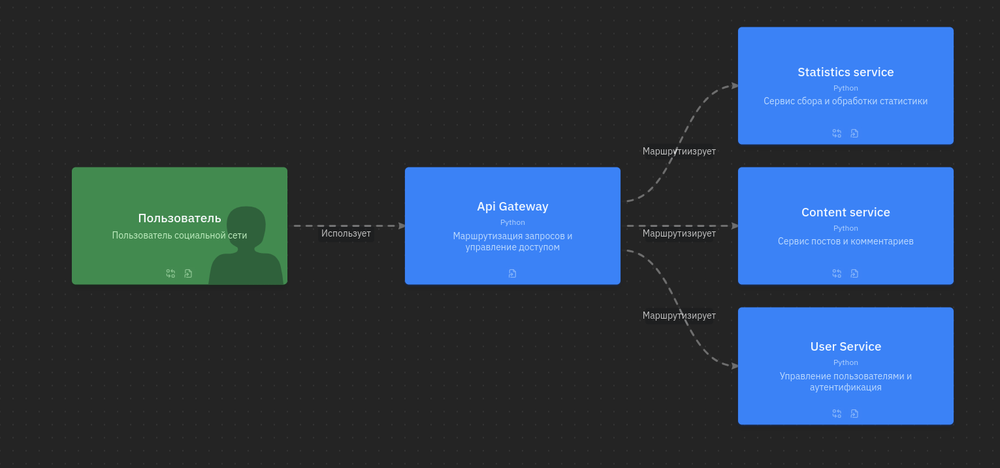

## API Gateway
_Сервис, отвечающий за маршрутизацию трафика между остальными сервисами. Принимает запроса от пользователя с UI и перенаправляет в нужные сервисы._

## Примеры запросов к серверу:

### Пример запроса регистрации
`curl -X POST http://localhost:5000/register -H "Content-Type: application/json" -d '{"login": "pupa", "password": "popa", "email": "pupa@yandex.ru"}'`

### Пример запроса авторизации
`curl -X POST http://localhost:5000/login -H "Content-Type: application/json" -d '{"login": "pupa", "password": "popa"}'`

### Пример запроса обновления
`curl -X PUT http://localhost:5000/update -H "Content-Type: application/json" -H "Authorization: TOKEN" -d '{"firstName": "oao", "lastName": "gerich", "dateOfBirth": "23-10-2007", "email": "12@re.ru", "phoneNumber": "+11003234356"}'`

### Пример запроса профиля
`curl -X GET http://localhost:5000/profile -H "Content-Type: application/json" -H "Authorization: TOKEN"`