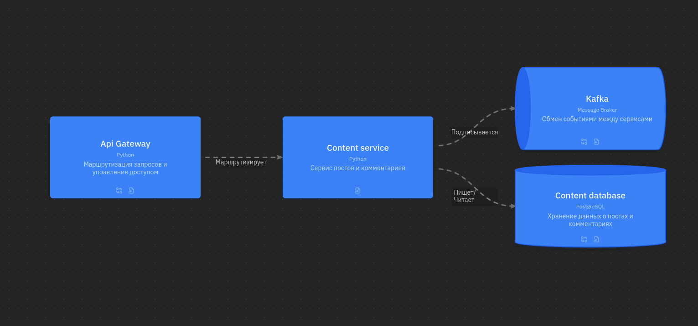

## Content service
_Сервис, отвечающий за информацию о постах и комментариях. Работает с базой данных PostgreSQL, которая хранит в себе информацию обо всех комментариях и постах социальной сети. Отвечает за получение постов пользователя, получение комментариев к посту/комментарию._

# Тут скоро будет сервис к моменту защиты