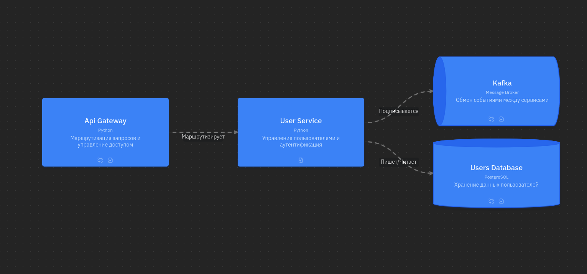

## User Service
_Сервис отвечает за авторизацию и хранение информации о пользователе. Взаимодействует с базой данных PostgreSQl, которая хранит все авторизационные данные, персональные данные и данные об активных сессиях пользователя._

